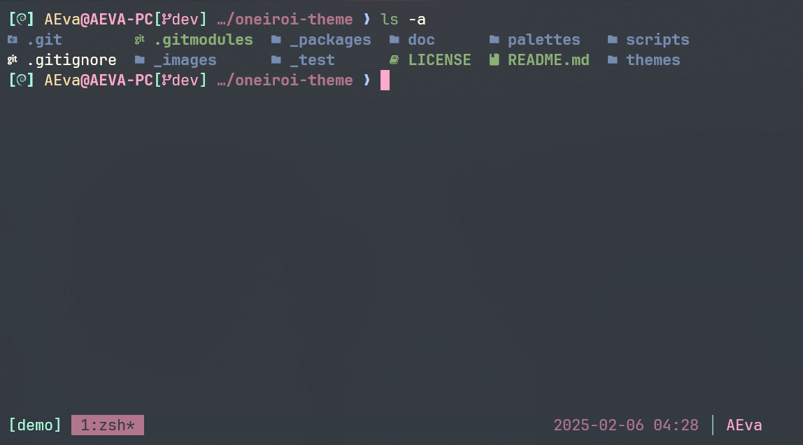
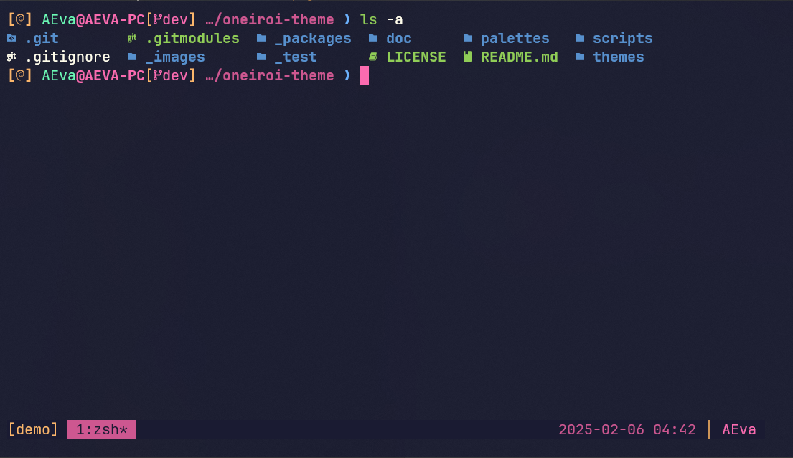

# Oneiroi theme for [Tmux](https://github.com/tmux/tmux/)

> A fantastic theme for `Tmux`.  

<p align="center">
  
</p>

## Themes available

- oneiroi dream

<p align="center">
  
</p>

- oneiroi melatonin

<p align="center">
  
</p>

## Installation

Compile and install:

1. Clone this repository

    ```bash
    git clone "https://github.com/OneiroiTheme/tmux.git" ./tmux
    cd ./tmux
    ```

2. Add this line to the bottom of `.tmux.conf`:

    ```bash
    run-shell /a/path/you/choose oneiroi.tmux
    ```

3. Reload Tmux by either restarting or reloading with:

    ```bash
    tmux source ~/.tmux.conf
    ```

Hello fantasy world!🎉
